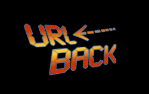

# URL <- Back



A simple way to get the referer URL for a page.

## Installation

`npm install url-back --save`

## How to use it

**Beware !** This header is sent by the client and can't be trusted !

Example in a Express app :

*users.js* route :

```javascript
var express = require('express');
var router = express.Router();

var urlBack = require('url-back');

// Get users in database...

/* GET / index (list users) */
router.get('/', function(req, res, next) {
  var back = urlBack(req);
  res.render('users/users', {title: 'Users list', users: users, urlBack: urlBack(req)});
});
```

*users.pug* file :

```javascript
extends ../layout

block content
  h1= title
  if !users.length
    p No user in database.
  else
    // ...

  if urlBack
    a(href= urlBack) go back
```

## Contributing

Any contributions are welcome !

## Notes

My english seems confusing ? Feel free to correct my 'frenchy' sentences !

## Licence

The MIT License (MIT) Copyright © 2016 Adrien Valcke

Permission is hereby granted, free of charge, to any person obtaining a copy of
this software and associated documentation files (the “Software”), to deal in
the Software without restriction, including without limitation the rights to
use, copy, modify, merge, publish, distribute, sublicense, and/or sell copies of
the Software, and to permit persons to whom the Software is furnished to do so,
subject to the following conditions:

The above copyright notice and this permission notice shall be included in all
copies or substantial portions of the Software.

THE SOFTWARE IS PROVIDED “AS IS”, WITHOUT WARRANTY OF ANY KIND, EXPRESS OR
IMPLIED, INCLUDING BUT NOT LIMITED TO THE WARRANTIES OF MERCHANTABILITY, FITNESS
FOR A PARTICULAR PURPOSE AND NON INFRINGEMENT. IN NO EVENT SHALL THE AUTHORS OR
COPYRIGHT HOLDERS BE LIABLE FOR ANY CLAIM, DAMAGES OR OTHER LIABILITY, WHETHER
IN AN ACTION OF CONTRACT, TORT OR OTHERWISE, ARISING FROM, OUT OF OR IN
CONNECTION WITH THE SOFTWARE OR THE USE OR OTHER DEALINGS IN THE SOFTWARE.
